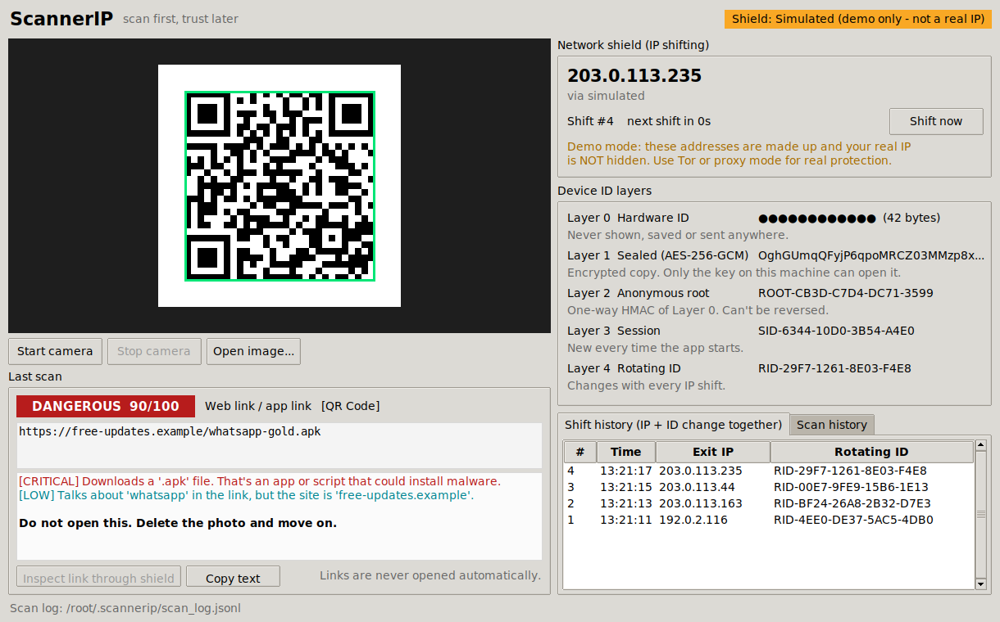

# ScannerIP

A QR code scanner that doesn't trust what it scans. It reads pretty much every kind of 2D code and barcode, checks what's inside for the usual scam tricks before anything gets opened, and sends its network traffic through a "shield" that shifts your IP address every few seconds. On top of that, your real device ID stays locked away behind layers of one-way IDs, and those change every time the IP does.

It started life as a school project, so the code is written to be read. Every file opens with a plain-English explanation of what it does and why.



## The honest bit first

A QR code is just text. It can't install malware on its own, and changing your IP address won't make a dodgy code any less dodgy. What actually hurts people is what the phone does next: opening a phishing page, installing an APK, joining a fake Wi-Fi network or paying a merchant code that's been swapped for a scammer's. So ScannerIP's main line of defence is the analyser. It reads the code and flags trouble *before* anything is opened, and links are never opened automatically.

The IP shifting and the ID layers are about privacy, and that matters too. The moment you visit a malicious link, the attacker's server logs your IP address, which gives away roughly where you are and which network you're on, and lets them link your visits together. If you want to see where a suspicious link really goes, ScannerIP follows it through Tor or a proxy. The server only ever sees a borrowed address, and a few seconds later that's gone as well. That's the real job of the shield.

## What it does

It reads QR Code (Model 1 and 2), Micro QR, rMQR, Aztec, Data Matrix, PDF417, MaxiCode and the common 1D barcodes (EAN, UPC, Code 128, Code 39, ITF, Codabar, DataBar), from a webcam or from image files. Rotated, inverted and tiny codes are fine.

It works out what the code actually is (a link, Wi-Fi details, a contact card, an SMS, a phone number, an email, a map location, a calendar event, a 2FA setup, a crypto or merchant payment, plain text or raw binary) and runs it through a set of checks. These cover look-alike and punycode domains, the `https://paypal.com@evil.site` trick, bare IP addresses, link shorteners, APK and EXE downloads, `javascript:` and `data:` links, USSD codes disguised as phone numbers, premium-rate SMS short codes, open or WEP Wi-Fi, payment codes whose checksum doesn't add up and hidden right-to-left characters. You get a score out of 100 and some plain advice.

The shield shifts the IP on a timer through Tor (free) or a list of proxies you supply. It then derives a fresh set of device IDs (more on those below) for every shift.

"Inspect link through shield" follows a link's redirects one hop at a time without ever loading the page, so you can see where a shortened link actually lands.

## Getting it running

You'll need Python 3.10 or newer.

```
git clone https://github.com/hamzaofficial1478-lang/scannerIP.git
cd scannerIP
pip install -r requirements.txt
python -m scannerip
```

On Linux you might also need `sudo apt install python3-tk` for the window to open. Windows and macOS installs of Python already include it.

That opens the app in **demo mode**, with an orange banner across the top. The IP addresses it shows are made up, which is handy for a presentation, but your real IP isn't hidden. For the real thing you need Tor. The easiest way is to install [Tor Browser](https://www.torproject.org/download/), leave it open in the background and run:

```
python -m scannerip --mode tor
```

ScannerIP finds Tor by itself on port 9050 or 9150. If you've got proxies instead, put one per line in a text file (`socks5h://host:port` or `http://host:port`) and run `python -m scannerip --mode proxy --proxies proxies.txt`.

Do check with your teacher before running Tor on the school network. Plenty of schools block it or don't allow it, which is exactly why demo mode exists.

There's also a terminal version of everything:

```
python -m scannerip scan samples/*.png       # scan image files
python -m scannerip camera                   # webcam scanning in the terminal
python -m scannerip shield --mode tor        # just watch the IP and ID shift
python -m scannerip identity                 # print the ID layers
python -m scannerip inspect https://bit.ly/abc --mode tor
python -m scannerip samples my-folder        # regenerate the test codes
```

The `samples` folder already holds 24 test codes, from a perfectly normal BBC link to a fake WhatsApp APK, a tampered payment code and a few of the more unusual formats. Every "malicious" one points at reserved `.example` names or documentation IP ranges, so none of them go anywhere real. Print a few out for the demo.

## How the IP shifting works

With Tor, every shift connects to Tor's SOCKS port using a new made-up username. Tor has a setting called `IsolateSOCKSAuth` (on by default) that puts each different username on its own circuit. That means a different exit relay and, almost always, a different public IP. If Tor's control port is open, ScannerIP also sends the `NEWNYM` "new identity" signal. Traffic uses `socks5h`, so even the DNS lookups go through Tor rather than leaking out on your normal connection. After each shift it asks `check.torproject.org` which address it can see, so the IP on screen is the real exit address and not a guess.

The default is a shift every 30 seconds with Tor. You can go down to 10 (`--interval 10`), but no lower, because Tor only honours `NEWNYM` about once every 10 seconds. The Tor Project also asks people not to churn through circuits for no reason, since it puts load on a network run by volunteers. With proxies the default is 10 seconds, and in demo mode it's 5.

Demo mode uses the RFC 5737 documentation ranges (192.0.2.x, 198.51.100.x and 203.0.113.x). Those are reserved for examples and can never belong to a real machine, and demo mode refuses to carry any traffic at all, so it can't give you a false sense of safety.

## The ID layers

| Layer | What it is | When it changes |
|---|---|---|
| 0 Hardware ID | Machine ID + network card MAC + computer name | Never. It's never shown, saved or sent |
| 1 Sealed | Layer 0 encrypted with AES-256-GCM | New ciphertext every shift (fresh random nonce) |
| 2 Anonymous root | HMAC-SHA256 of Layer 0 with a secret key | Stays the same on this device, can't be reversed |
| 3 Session | HMAC of the root with a random value | Every time the app starts |
| 4 Rotating ID | HMAC of the session with the shift number and exit IP | Every IP shift |

The secret key is 32 random bytes stored in `~/.scannerip/secret.key` (only readable by you), created the first time you run it. Every scan goes into `~/.scannerip/scan_log.jsonl` under the rotating ID rather than anything tied to your machine. If that log ever leaked, nobody could trace the scans back to you or even link them to each other across shifts.

A quick word on "no one can decode it". Layers 2, 3 and 4 are one-way, so there's no key in the world that turns them back into your device ID. Layer 1 is proper encryption, which means it *can* be opened, but only with the key on your machine. If someone copied both the key file and a sealed token off your computer, they could open it. A real product would keep that key in the operating system's keychain instead.

## Limits worth mentioning in your evaluation

The analyser works on heuristics. It can miss a well-built phishing page on a clean-looking domain, and now and then it'll flag something legitimate. A production app would also check links against a live threat feed such as [Google Safe Browsing](https://safebrowsing.google.com/).

Link inspection only follows HTTP redirects. Redirects done with JavaScript or a `<meta refresh>` inside the page aren't followed, on purpose, because the whole point is never loading the page.

Shifting your IP hides you from the website, not from everyone. The Tor exit or proxy can see any unencrypted traffic, and your school or internet provider can see that you're using Tor in the first place.

The "real domain" check uses a short built-in list of two-part endings like `.co.uk` and `.com.pk`, not the full [Public Suffix List](https://publicsuffix.org/).

## Inside the code

```
scannerip/
  decoder.py     reads codes from images and the webcam (ZXing-C++)
  payloads.py    works out what kind of data a code holds
  analyzer.py    the red-flag checks and the risk score
  rotator.py     IP shifting: Tor, proxy pool, demo mode, and the timer
  identity.py    the five ID layers
  inspector.py   follows a link's redirects through the shield
  scanlog.py     the scan history file
  samples.py     makes the demo codes
  gui.py         the desktop window (Tkinter)
  cli.py         the terminal commands
tests/           87 tests: pip install pytest, then python -m pytest
```

## References

- Federal Bureau of Investigation, Internet Crime Complaint Center (2022) *Cybercriminals Tampering with QR Codes to Steal Victim Funds*. Public Service Announcement I-011822-PSA. https://www.ic3.gov/PSA/2022/PSA220118
- National Cyber Security Centre (n.d.) *Phishing scams: how to spot and report them*. https://www.ncsc.gov.uk/collection/phishing-scams
- ZXing project (n.d.) *Barcode Contents*. GitHub wiki. https://github.com/zxing/zxing/wiki/Barcode-Contents
- ZXing-C++ (n.d.) *zxing-cpp*. https://github.com/zxing-cpp/zxing-cpp
- EMVCo (n.d.) *EMV QR Codes*. https://www.emvco.com/emv-technologies/qr-codes/
- The Tor Project (n.d.) *Tor manual* (see `SocksPort` and `IsolateSOCKSAuth`). https://2019.www.torproject.org/docs/tor-manual.html.en
- The Tor Project (n.d.) *Stem FAQ: How do I request a new identity from Tor?* https://stem.torproject.org/faq.html
- Krawczyk, H., Bellare, M. and Canetti, R. (1997) *HMAC: Keyed-Hashing for Message Authentication*. RFC 2104. https://www.rfc-editor.org/rfc/rfc2104
- Krawczyk, H. and Eronen, P. (2010) *HMAC-based Extract-and-Expand Key Derivation Function (HKDF)*. RFC 5869. https://www.rfc-editor.org/rfc/rfc5869
- Dworkin, M. (2007) *Recommendation for Block Cipher Modes of Operation: Galois/Counter Mode (GCM) and GMAC*. NIST Special Publication 800-38D. https://csrc.nist.gov/pubs/sp/800/38/d/final
- Arkko, J., Cotton, M. and Vegoda, L. (2010) *IPv4 Address Blocks Reserved for Documentation*. RFC 5737. https://www.rfc-editor.org/rfc/rfc5737
- Eastlake, D. and Panitz, A. (1999) *Reserved Top Level DNS Names*. RFC 2606. https://www.rfc-editor.org/rfc/rfc2606
- Davis, M. and Suignard, M. (n.d.) *Unicode Technical Report #36: Unicode Security Considerations*. https://www.unicode.org/reports/tr36/
