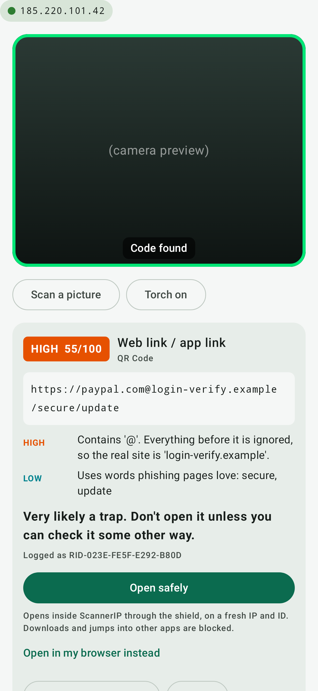
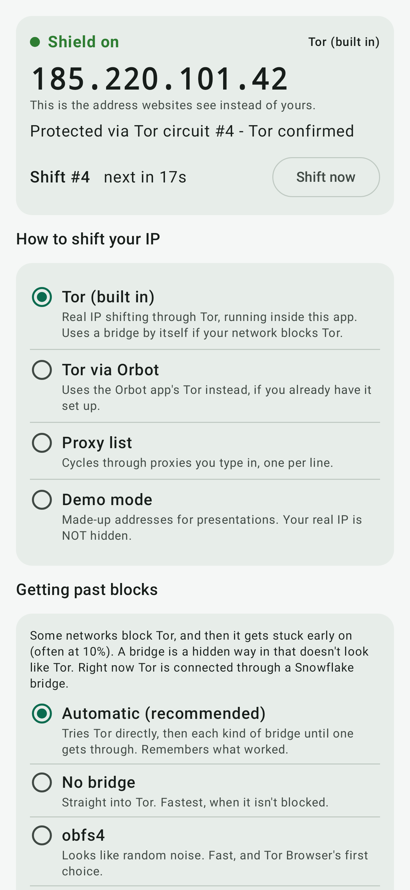
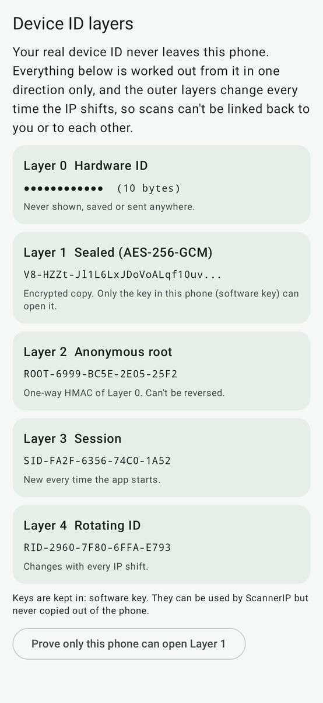
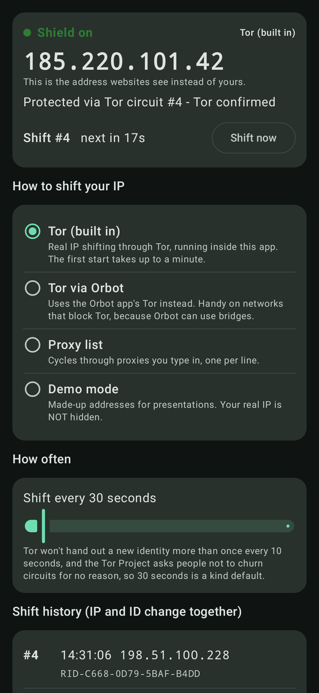

# ScannerIP

A QR code scanner for Android that doesn't trust what it scans. It reads pretty much every kind of 2D code and barcode, checks what's inside for the usual scam tricks before anything gets opened, and sends its network traffic through a "shield" that shifts your IP address every few seconds using Tor, which runs right inside the app. On top of that, your real device ID stays locked away behind layers of one-way IDs, and those change every time the IP does.

It started life as a school project, so the code is written to be read. Every file opens with a plain-English explanation of what it does and why. There's also the original desktop version in Python, which does the same job on a laptop.

<p>




</p>

## The honest bit first

A QR code is just text. It can't install malware on its own, and changing your IP address won't make a dodgy code any less dodgy. What actually hurts people is what the phone does next: opening a phishing page, installing an APK, joining a fake Wi-Fi network or paying a merchant code that's been swapped for a scammer's. So ScannerIP's main line of defence is the analyser. It reads the code and flags trouble *before* anything is opened, and links are never opened automatically.

The IP shifting and the ID layers are about privacy, and that matters too. The moment you visit a malicious link, the attacker's server logs your IP address, which gives away roughly where you are and which network you're on, and lets them link your visits together. If you want to see where a suspicious link really goes, ScannerIP follows it through Tor. The server only ever sees a borrowed address, and a few seconds later that's gone as well. That's the real job of the shield.

## Getting it on your phone

You need Android 8.0 or newer. Every time `main` changes, GitHub builds the app and puts it on the [Releases page](https://github.com/hamzaofficial1478-lang/scannerIP/releases/tag/latest) as `ScannerIP.apk`, and the [direct download link](https://github.com/hamzaofficial1478-lang/scannerIP/releases/download/latest/ScannerIP.apk) always points at the newest one. Open it on your phone, download the file and tap it. Android will ask you to allow installs from your browser or Files app the first time, and Play Protect may warn you because the app isn't from the Play Store. That's expected for something you've built yourself, so choose "Install anyway". Every build is also attached to its run on the Actions tab, zipped up as `ScannerIP-apk`.

The APK is around 10 MB. If the download reaches 100% but your browser still says it's downloading, the file is usually on your phone already and the browser is just stuck on its own safety check. Open the Files app, go to Downloads and tap `ScannerIP.apk` from there. If it isn't there, cancel the download and try again in Chrome itself, not from a link inside another app such as WhatsApp. Wi-Fi helps too.

The first time you open it, allow the camera and give the built-in Tor up to a minute to connect. The chip in the top corner turns green and shows your new exit IP once it's ready. If your school or home network blocks Tor (some do), install [Orbot](https://orbot.app/), turn on one of its bridges and pick "Tor via Orbot" in the Shield tab. For a classroom demo with no internet at all, there's Demo mode, which is clearly marked in orange because its IPs are made up. Do check with your teacher before using Tor on the school network.

## Keeping it up to date

A phone can't `git pull` and run the source code, because it only runs a finished app. So ScannerIP does the next best thing. Each build GitHub makes is numbered (1.0.12, 1.0.13 and so on) and published with a small `version.json` that holds its version number and the APK's SHA-256 fingerprint. The app checks that file when it starts, and if there's a newer build, a banner appears at the top with an **Update now** button. Tapping it downloads the new APK through the shield and runs four checks: the fingerprint matches, it's really ScannerIP, it's newer, and it's signed with the same key. Only then is it handed to Android. Android asks you to confirm the update once, because it never lets an app replace itself silently. From Android 12 on, later updates can skip that question. Your scans, settings and IDs all stay put.

With the app closed, it still checks about twice a day and sends you a notification when something new is out. You can switch that off in the Shield tab. It's worth knowing that this background check goes straight to GitHub, because Tor isn't running while the app is closed, so GitHub sees your IP when it happens. The very first in-app update also asks you to let ScannerIP install apps, which is one switch in Android's settings. And a version you installed before the updater existed has to be updated by hand once, from the link above.

The other idea, keeping the program on GitHub and using the phone only as a screen, sounds neat but doesn't work here. GitHub isn't built to answer an app's requests in real time. More importantly, every code you scanned would leave your phone, which is exactly what this project is trying to avoid.

## What it does

The app has five tabs. **Scan** points the camera at a code (or reads a screenshot from your gallery) and shows a risk report straight away, with a green frame and a buzz when it spots something. **Check** lets you paste a link or text from anywhere, and has the 20 demo codes built in so you can show off every warning without printing anything. **Shield** shows the live exit IP, a countdown to the next shift and the shift history, and lets you choose how the IP gets shifted. **IDs** shows the five ID layers changing in real time. **History** keeps every scan under the rotating ID that was live at the time.

It reads QR Code (Model 1 and 2), Micro QR, rMQR, Aztec, Data Matrix, PDF417, MaxiCode and the common 1D barcodes (EAN, UPC, Code 128, Code 39, ITF, Codabar, DataBar). Rotated, inverted and tiny codes are fine. Both versions use the same ZXing-C++ decoder.

It works out what the code actually is (a link, Wi-Fi details, a contact card, an SMS, a phone number, an email, a map location, a calendar event, a 2FA setup, a crypto or merchant payment, plain text or raw binary) and runs it through a set of checks. These cover look-alike and punycode domains, the `https://paypal.com@evil.site` trick, bare IP addresses, link shorteners, APK and EXE downloads, `javascript:` and `data:` links, USSD codes disguised as phone numbers, premium-rate SMS short codes, open or WEP Wi-Fi, payment codes whose checksum doesn't add up and hidden right-to-left characters. You get a score out of 100 and some plain advice. The phone version is tested to give exactly the same score as the desktop one for every demo code.

"Check where it goes" follows a link's redirects one hop at a time through Tor without ever loading the page, so you can see where a shortened link actually lands.

## How the IP shifting works

On the phone, Tor runs inside the app using the Guardian Project's tor-android library, which is the same Tor that powers Orbot. Every shift connects to Tor using a new made-up username. Tor has a setting called `IsolateSOCKSAuth` (on by default) that puts each different username on its own circuit, which means a different exit relay and, almost always, a different public IP. ScannerIP also sends Tor the `NEWNYM` "new identity" signal. After each shift it asks `check.torproject.org` which address it can see, so the IP on screen is the real exit address and not a guess.

The app talks to Tor through its own small SOCKS5 client rather than Android's built-in one. That's deliberate. The built-in one looks up a website's name on your normal connection before handing it to Tor, which would leak every site you check to whoever runs your network's DNS. ScannerIP always passes the name itself to Tor, and there's a test that proves it: it asks for a `.invalid` address that can never be looked up locally, so the test only passes if the name went through the proxy.

The default is a shift every 30 seconds with Tor. You can go down to 10, but no lower, because Tor only honours `NEWNYM` about once every 10 seconds. The Tor Project also asks people not to churn through circuits for no reason, since it puts load on a network run by volunteers. With a proxy list the default is 10 seconds, and in demo mode it's 5.

Demo mode uses the RFC 5737 documentation ranges (192.0.2.x, 198.51.100.x and 203.0.113.x). Those are reserved for examples and can never belong to a real machine, and demo mode refuses to carry any traffic at all, so it can't give you a false sense of safety.

## The ID layers

| Layer | What it is | When it changes |
|---|---|---|
| 0 Hardware ID | On the phone: Android ID + maker + model. On a laptop: machine ID + network card MAC + computer name | Never. It's never shown, saved or sent |
| 1 Sealed | Layer 0 encrypted with AES-256-GCM | New ciphertext every shift (fresh random nonce) |
| 2 Anonymous root | HMAC-SHA256 of Layer 0 with a secret key | Stays the same on this device, can't be reversed |
| 3 Session | HMAC of the root with a random value | Every time the app starts |
| 4 Rotating ID | HMAC of the session with the shift number and exit IP | Every IP shift |

On the phone, both keys are generated inside the Android Keystore. The app can use them but nobody can read them out, not even the app itself, and on most phones they sit in secure hardware. So Layer 1 really can only be opened on that one phone, and the IDs tab has a button that proves it. The Android ID it starts from is already unique to this app on this phone, so it couldn't be used to follow you between apps even if it did leak.

A quick word on "no one can decode it". Layers 2, 3 and 4 are one-way, so there's no key in the world that turns them back into your device ID. Layer 1 is proper encryption, which means it *can* be opened, but only with the key on your device. The desktop version keeps that key in a file in your home folder instead, so there, someone who copied the key file and a sealed token off your computer could open it.

Every scan is saved under the rotating ID rather than anything tied to the device. If the history ever leaked, nobody could trace the scans back to you or even link them to each other across shifts. The app also opts out of Android's cloud backups, so none of this leaves the phone.

## Limits worth mentioning in your evaluation

The analyser works on heuristics. It can miss a well-built phishing page on a clean-looking domain, and now and then it'll flag something legitimate. A production app would also check links against a live threat feed such as [Google Safe Browsing](https://safebrowsing.google.com/).

Link inspection only follows HTTP redirects. Redirects done with JavaScript or a `<meta refresh>` inside the page aren't followed, on purpose, because the whole point is never loading the page.

Shifting your IP hides you from the website, not from everyone. The Tor exit can see any unencrypted traffic, and your school or internet provider can see that you're using Tor in the first place.

The "real domain" check uses a short built-in list of two-part endings like `.co.uk` and `.com.pk`, not the full [Public Suffix List](https://publicsuffix.org/).

The Android app was built and tested on a computer, including screenshots of every screen rendered with Robolectric, but not yet on a real phone. Tor's first start, the camera and the Keystore are the parts that only a real device can fully prove. The APK is signed with a demo key that lives in this repo, so every new build installs over the old one. That's fine for a school project, but anyone could sign an app with that key, so make your own before publishing anywhere. (The in-app updater only fetches from this repo's own releases over HTTPS and checks the fingerprint, so a stranger can't push an update through it. But someone could still trick you into installing a fake app signed with the public demo key from somewhere else.) The shield only runs while the app is open, and Tor uses a bit of battery and data while it does.

## The desktop version

It's the same scanner for Windows, macOS and Linux, with a window and a terminal mode. You'll need Python 3.10 or newer.

```
pip install -r requirements.txt
python -m scannerip                          # the window, in demo mode
python -m scannerip --mode tor               # with Tor Browser open in the background
python -m scannerip scan samples/*.png       # scan image files
python -m scannerip inspect https://bit.ly/abc --mode tor
```

On Linux you might need `sudo apt install python3-tk` for the window. It finds Tor by itself on port 9050 or 9150, and `--mode proxy --proxies proxies.txt` uses your own list instead. The `samples` folder holds 24 printable test codes, from a perfectly normal BBC link to a fake WhatsApp APK. Every "malicious" one points at reserved `.example` names or documentation IP ranges, so none of them go anywhere real.


## Inside the code

```
android/
  core/          plain Kotlin, no phone needed: payloads, analyser, ID layers,
                 SOCKS5 client, rotators, shield timer, link inspector, scan log,
                 update checker
                 (76 tests: cd android && ./gradlew :core:test)
  app/           the Android app: camera and ZXing-C++, built-in Tor, Android
                 Keystore keys, the updater, and the five Compose screens
                 (27 tests including screenshots: ./gradlew :app:testDebugUnitTest)
scannerip/       the desktop version in Python (87 tests: python -m pytest)
samples/         printable demo codes
```

To build the APK yourself you need JDK 17 or newer and the Android SDK with platform 37.1 (Android Studio will offer to install it). Then run `./gradlew assembleRelease` inside `android/` and the app turns up in `android/app/build/outputs/apk/release/`.

## References

- Federal Bureau of Investigation, Internet Crime Complaint Center (2022) *Cybercriminals Tampering with QR Codes to Steal Victim Funds*. Public Service Announcement I-011822-PSA. https://www.ic3.gov/PSA/2022/PSA220118
- National Cyber Security Centre (n.d.) *Phishing scams: how to spot and report them*. https://www.ncsc.gov.uk/collection/phishing-scams
- ZXing project (n.d.) *Barcode Contents*. GitHub wiki. https://github.com/zxing/zxing/wiki/Barcode-Contents
- ZXing-C++ (n.d.) *zxing-cpp*. https://github.com/zxing-cpp/zxing-cpp
- EMVCo (n.d.) *EMV QR Codes*. https://www.emvco.com/emv-technologies/qr-codes/
- The Tor Project (n.d.) *Tor manual* (see `SocksPort` and `IsolateSOCKSAuth`). https://2019.www.torproject.org/docs/tor-manual.html.en
- The Tor Project (n.d.) *Stem FAQ: How do I request a new identity from Tor?* https://stem.torproject.org/faq.html
- Guardian Project (n.d.) *tor-android*. Maven Central. https://central.sonatype.com/artifact/info.guardianproject/tor-android
- Guardian Project (n.d.) *Orbot*. https://orbot.app/
- Android Developers (n.d.) *Android Keystore system*. https://developer.android.com/privacy-and-security/keystore
- Android Developers (n.d.) *Settings.Secure: ANDROID_ID*. https://developer.android.com/reference/android/provider/Settings.Secure#ANDROID_ID
- Leech, M., Ganis, M., Lee, Y., Kuris, R., Koblas, D. and Jones, L. (1996) *SOCKS Protocol Version 5*. RFC 1928. https://www.rfc-editor.org/rfc/rfc1928
- Leech, M. (1996) *Username/Password Authentication for SOCKS V5*. RFC 1929. https://www.rfc-editor.org/rfc/rfc1929
- Krawczyk, H., Bellare, M. and Canetti, R. (1997) *HMAC: Keyed-Hashing for Message Authentication*. RFC 2104. https://www.rfc-editor.org/rfc/rfc2104
- Krawczyk, H. and Eronen, P. (2010) *HMAC-based Extract-and-Expand Key Derivation Function (HKDF)*. RFC 5869. https://www.rfc-editor.org/rfc/rfc5869
- Dworkin, M. (2007) *Recommendation for Block Cipher Modes of Operation: Galois/Counter Mode (GCM) and GMAC*. NIST Special Publication 800-38D. https://csrc.nist.gov/pubs/sp/800/38/d/final
- Arkko, J., Cotton, M. and Vegoda, L. (2010) *IPv4 Address Blocks Reserved for Documentation*. RFC 5737. https://www.rfc-editor.org/rfc/rfc5737
- Eastlake, D. and Panitz, A. (1999) *Reserved Top Level DNS Names*. RFC 2606. https://www.rfc-editor.org/rfc/rfc2606
- Davis, M. and Suignard, M. (n.d.) *Unicode Technical Report #36: Unicode Security Considerations*. https://www.unicode.org/reports/tr36/
